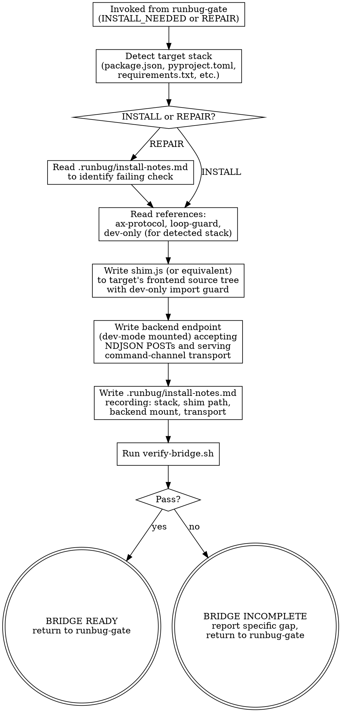

# Install Bridge

<HARD-GATE>
I1 — Do NOT install the shim or backend route into a production build path. Activation must be gated by the stack's dev flag (`import.meta.env.DEV`, `NODE_ENV === 'development'`, `app.debug`, Django `DEBUG`, etc.). The shim identifier must not appear in production bundle output. See `references/dev-only.md` for the per-stack guard + prod-bundle grep.
</HARD-GATE>

<HARD-GATE>
I2 — Do NOT install a forwarder without a reentrancy loop guard. The shim must use the `createGuard` / `guard.enter()` / `guard.exit()` pattern from `references/shim.js` (or an equivalent reentrancy flag under another name); any `console.*` made while the guard is active must not be forwarded, and the fetch-error path must not call `console.*`. See `references/loop-guard.md` for the pattern.
</HARD-GATE>

<HARD-GATE>
I3 — Do NOT accept any command channel address with keys outside `{role, accessibleName, nth?}`. If Claude cannot reach an element, the fix is to add `aria-label` to the app code. Never add `data-testid` to the app or extend the address schema. See `references/ax-protocol.md`.
</HARD-GATE>

<HARD-GATE>
I5 — Do NOT run `capture.sh --headless` against a dev server other than the one `$RUNBUG_URL` / `--url` points at. Stale-URL captures produce empty fixtures that can falsely clear T3. Confirm the URL matches the live dev server before every unattended capture run.
</HARD-GATE>

## Anti-Pattern

**"This shim is too small to need a protocol."** Every runbug installation implements the exact wire format in `references/ax-protocol.md`. A one-off "just POST a string" install creates immediate drift: the tail script breaks, the gate's evidence check breaks, any future capture-replay tool breaks. Follow the protocol.

## Core Principle

Three channels, one protocol, zero runtime dependencies:

1. **Console-forward** — frontend `console.*` → backend log
2. **AX-snapshot** — on demand, shim emits a pruned accessibility tree
3. **Command-channel** — backend pushes AX-addressed interactions; shim dispatches synthetic events

The shim is plain JS, lifted and adapted from `references/shim.js`. The backend endpoint is written in whatever language the target uses. The transport (SSE, WebSocket, polling) is chosen per stack; the payload schema is fixed.

## Process Flow



## Checklist

Complete in order.

1. Read `references/ax-protocol.md`. This is the wire contract every subsequent step implements.
2. Read `references/loop-guard.md`. The forwarder must satisfy this pattern.
3. Detect the target stack: inspect `package.json`, `pyproject.toml`, `requirements.txt`, `go.mod`, project layout.
4. Read the matching section of `references/dev-only.md`. Note the activation guard and prod-bundle grep pattern.
5. Read `references/shim.js`. This is the reference implementation.
6. Write the shim into the target project's frontend source tree. Place it where other dev-only modules live (next to `main.js` / `app.tsx` / equivalent). Wrap the import with the dev-only activation guard from step 4.
7. Write the backend endpoint. Accept NDJSON POSTs at `/runbug/log`. Mount the command-channel transport (SSE recommended for Node/Python; polling acceptable as fallback) at `/runbug/commands`. Mount only when the stack's dev flag is set.

   **v1.1 backend additions:** the endpoint must also (a) broadcast every `configure` event received on POST `/runbug/commands` to all connected SSE clients so the shim receives it, (b) accept POST `/runbug/log` for `console`, `shim-ready`, and `dom-event` event types and append each line verbatim to `.runbug/log`, (c) reject POSTs whose `type` is outside the per-endpoint allowlist — `/runbug/commands` accepts `{snapshot-request, action, configure}`, `/runbug/log` accepts `{console, shim-ready, dom-event}` — for defense-in-depth.

8. Write `.runbug/install-notes.md` in the target project. Record: detected stack, shim path, backend entry point, transport choice, activation guard used, prod-bundle grep command used.
9. Run `verify-bridge.sh` from the target project root. All three checks must pass.
10. If verify fails, repair the specific failing check and re-run. Cap at 3 attempts, then return `BLOCKED_INSTALL` (or `BLOCKED_REPAIR` if in repair mode).
11. On success, print `BRIDGE READY` with the install-notes path, and return to runbug-gate.

## Step Details

### Step 3: Detect target stack

Order of inspection:

- `package.json` with `vite` or `@vitejs/plugin-*` → Vite
- `package.json` with `next` → Next.js
- `package.json` with `webpack` or `react-scripts` → Webpack/CRA
- `package.json` with `express` or `fastify` or `koa` → Node backend
- `pyproject.toml` with `fastapi` / `flask` / `django` → Python backend
- Multiple of the above → hybrid; install shim per frontend stack and backend per backend stack

If the stack is none of the above: read `references/dev-only.md`'s "If the stack is not listed" section and document the chosen guard + grep in `.runbug/install-notes.md`.

### Step 6: Writing the shim

Do NOT copy `references/shim.js` verbatim if the target uses a different module system. Adapt:

- ESM target (`"type": "module"`, Vite, modern): copy the `export` syntax unchanged
- CommonJS target: replace `export function X` with `module.exports.X = function X`
- Script-tag target (no bundler): drop the exports, attach to `window.__runbug` namespace

The three HARD-GATE constraints survive all adaptations.

**v1.3 mount wiring.** The exports (`emitShimReady`, `configureFromEvent`, `installDomWatcher`, `shouldHandleEvent`) require boilerplate the adapter must assemble. v1.3 adds per-tab routing: the shim generates a `tabId` at mount, every emitted event carries it, and inbound events with a `targetTab` are filtered via `shouldHandleEvent` at the SSE entry point. Minimum wiring in the adapter's mount block:

```javascript
import {
  createGuard, createForwarder, installConsoleProxy,
  emitShimReady, configureFromEvent, installDomWatcher,
  shouldHandleEvent,
} from './runbug-shim.js';

const tabId = crypto.randomUUID();

const guard = createGuard();
const consoleForwarder = createForwarder({ endpoint: '/runbug/log', fetch, guard, tabId });
installConsoleProxy({ forward: consoleForwarder });

const genericForward = (type, payload) =>
  fetch('/runbug/log', {
    method: 'POST',
    headers: { 'content-type': 'application/ndjson' },
    body: JSON.stringify({ type, ts: new Date().toISOString(), tabId, ...payload }),
  });

emitShimReady(genericForward, location.href, '0.4.0');

let detachDom = null;
const shimForConfigure = {
  setDomWatcherEvents: (events) => {
    if (detachDom) { detachDom(); detachDom = null; }
    if (events.length > 0) {
      detachDom = installDomWatcher(document, genericForward, events);
    }
  },
};

const sse = new EventSource('/runbug/commands');
sse.onmessage = (e) => {
  try {
    const event = JSON.parse(e.data);
    if (!shouldHandleEvent(event, tabId)) return;
    configureFromEvent(event, shimForConfigure, consoleForwarder);
  } catch {}
};
```

The same `shouldHandleEvent(event, tabId)` filter applies to the action dispatch hook (adapter-specific; not shown in this minimal block).

Adapters in non-browser hosts (SSR pre-render, workers) skip this block — shim is dev-tab-only.

### Step 7: Writing the backend endpoint

The endpoint logic is ~20 lines in any language. Requirements:

- Accept `POST /runbug/log` with `content-type: application/ndjson`
- Append each line verbatim to `.runbug/log` in the project root
- Create `.runbug/` if missing
- Serve `GET /runbug/commands` as SSE (or `/runbug/poll` as polling) for the command channel
- Return 404 if mounted in a production build (gated by dev flag — belt-and-suspenders with the shim's own gate)

### Step 8: `.runbug/install-notes.md` shape

```markdown
# Runbug install notes

Installed: <ISO-8601 timestamp>
Stack: <detected stack>
Shim path: <path in source tree>
Activation guard: <exact code used>
Backend entry: <file:line>
Transport: <SSE | WebSocket | polling>
Prod-bundle grep: <exact command verify-bridge.sh runs>
```

### Step 9: verify-bridge.sh from the runbug plugin

`verify-bridge.sh` lives at `<runbug-plugin-root>/skills/install-bridge/scripts/verify-bridge.sh`. Run it from the target project root with environment variables overriding the defaults if the install-notes specify a non-default shim identifier or prod directory.

## Post-install: running captures

After `BRIDGE READY`, three scripts become available for driving and capturing frontend interactions. Use the one that matches the task.

| Intent | Script | Output |
|---|---|---|
| "What's the current page state?" | `scripts/snap.sh [--until-role <role>] [--until-name <name>] [--timeout <s>] [--tab <id>]` | Latest snapshot event to stdout |
| "Drive one action and show me the result." | `scripts/do.sh [--wait-url <prefix>] [--timeout <s>] [--tab <id>] -- <role> <name> <action> [value] [nth]` | Matching action-result to stdout |
| "Run a scripted sequence and capture everything." | `scripts/capture.sh --fixtures <path> [--headless] [--watch-dom] [--keep-last N] [--tab <id>]` | NDJSON capture file under `.runbug/captures/<ts>.ndjson` |
| "Prune the persistent log." | `scripts/prune-log.sh --keep-last <N>` | `prune-log: kept N, deleted D` to stderr |

### Auto-generating fixtures from a diff

When the fixture set for a given change would otherwise be hand-authored, delegate to the `generate-fixtures` skill (added in v1.2). It runs `snap.sh`, reads the current git diff, and emits one fixture line per AX-addressable element whose accessible name appears in the diff. Fail-open when signal is weak — caller falls back to hand-authoring. See `skills/generate-fixtures/SKILL.md` for the full contract.

### Fixture format

`scripts/fixtures.example.ndjson` is the template. One NDJSON action event per line. Lines containing `__comment` are skipped by the runner so the file is self-documenting. Required fields: `type`, `id`, `target`, `action`. Optional: `value`, `nth`.

### `--wait-url` and `--until-*` for multi-step flows

When a click triggers a route change or async render, fixed sleeps are brittle. Use `do.sh --wait-url <prefix>` after a navigation-triggering action, or `snap.sh --until-role <role>` / `snap.sh --until-name <name>` to poll until the post-action AX state appears. Both default to `--timeout 10` seconds; pass `--timeout <s>` to override. Without these flags, the scripts retain v1.2 single-shot behavior.

`snap.sh` polls every 250ms via re-issued `snapshot-request` events. `do.sh --wait-url` polls the same way after `action-result` returns.

### `prune-log.sh` for log retention

`.runbug/log` accumulates across sessions. `capture.sh --keep-last N` only prunes `.runbug/captures/`. Use `prune-log.sh --keep-last <N>` to truncate the persistent log to the newest N lines. Opt-in only — never runs automatically. Atomic rewrite (no partial-write window).

### `--watch-dom` for E2E interoperability

When running Playwright / Cypress / any harness whose synthetic clicks bypass `console.*`, pass `--watch-dom` to `capture.sh`. The shim attaches capture-phase `click` and `submit` listeners for the duration of the session and forwards each as a `dom-event` addressed by `{role, accessibleName}`. Detaches automatically at EXIT. Zero runtime cost outside an active capture session.

### `--keep-last N` for capture retention

Opt-in retention. Pass `--keep-last N` (positive integer) to `capture.sh` and after the session writes its NDJSON file, older captures in `.runbug/captures/` are pruned to leave the N newest by mtime. Default off (no flag = keep everything). One `retention: kept <N>, deleted <D>` line is written to stderr when pruning runs.

### Session lifecycle responsibilities

- `capture.sh` owns browser launch (tiered: `$RUNBUG_BROWSER` → `--headless` → OS default), shim-ready polling (timeout `--wait`, default 15s), configure events, fixture dispatch, log tailing, and EXIT cleanup.
- `snap.sh` and `do.sh` make single curl calls — they do not manage session state and assume a browser is already attached.
- If the fixture triggers navigation, the shim re-emits `shim-ready` and resets `watch_dom` to `[]` (no attached events). The capture driver does not auto-replay configure across reloads — structure fixtures to avoid mid-session navigation, or run the session with the reload-aware wrapper documented in the reference shim.

### Multi-tab limitation (v1.1)

If more than one browser tab is open on the dev URL, both shims attach to the same SSE channel. Configure events broadcast to all; shim-ready events arrive per-tab; dom-events interleave. For deterministic captures, close extra tabs before starting `capture.sh`.

## Gate Functions

- BEFORE writing the shim: "Have I read `ax-protocol.md` in this session?"
- BEFORE wrapping the shim's import: "Does the chosen activation guard match the stack's build tool's dead-code-elimination semantics for dev vs prod?"
- BEFORE writing the forwarder: "Does my forwarder's fetch-error path call `console.*`? If yes, I am violating I2."
- BEFORE writing the command dispatcher: "Does my dispatcher accept any key other than `{role, accessibleName, nth}`? If yes, I am violating I3."
- BEFORE running verify-bridge.sh: "Does `.runbug/install-notes.md` exist with the correct stack metadata?"
- BEFORE returning BRIDGE READY: "Did all three `verify-bridge.sh` checks print pass lines, or did one silently skip?"

## Rationalization Table

| You think... | Reality |
|---|---|
| "The app has no `aria-label`s yet, let me just allow `data-testid` for now" | That is I3 violation. Add `aria-label` to the app. Runbug's whole point is to raise the a11y floor. |
| "The dev flag check is redundant if the backend route returns 404 in prod" | Defense-in-depth. Ship both. A leaked shim without a route is still a privacy leak into the prod bundle. |
| "My fetch error handler is tiny, it won't actually loop" | "Tiny" infinite loops still pin CPU and block the page. Loop guard is non-negotiable. |
| "I'll skip writing install-notes.md, the shim is self-documenting" | verify-bridge.sh and future repair runs need it. Write the notes. |
| "verify-bridge.sh skipped I1 because there was no prod bundle — that counts as pass" | No. Skipped is not pass. Install-bridge must trigger a production build (`npm run build` / equivalent) and re-run I1. |
| "The shim doesn't need tests in the target project, the reference tests cover it" | The reference tests cover the DOM-independent logic. The target-adapted shim needs install-time integration check via verify-bridge.sh. |
| "I can fix this by changing the reference shim rather than the adaptation" | Reference shim is the contract. If adaptation conflicts, the adaptation is wrong. Don't modify the reference to make a broken adaptation pass. |

## Red Flags

- A shim file path that doesn't include `dev` in the activation guard
- A forwarder that calls `console.error` in its catch block
- A command dispatcher that accepts `target.selector` or `target.testId`
- An `install-notes.md` with `TBD` or missing fields
- verify-bridge.sh skipping I1 because no prod build was attempted
- Claude repairing by modifying `verify-bridge.sh` to be "less strict"
- Multiple shim files in the target project — there must be exactly one

## Key Principles

- **Protocol-first, library-last.** Wire format is constant across stacks.
- **Dev-only, always.** I1 is non-negotiable.
- **Loop guard, always.** I2 is non-negotiable.
- **AX-addressable, always.** I3 is non-negotiable.
- **One shim per project.** Multiple installations means one is stale or wrong.
- **Install-notes is the repair handoff.** Future repair runs read it first.

## The Bottom Line

Write and execute a script (or run the steps manually) that confirms:

1. `.runbug/install-notes.md` exists with all required fields populated
2. The shim file is present at the recorded path and contains the loop-guard pattern
3. The backend entrypoint mounts runbug routes only under the dev flag
4. `verify-bridge.sh` exits 0 with all three integrity checks printing pass lines (no skips on I1 — trigger a prod build if needed to exercise it)

Print `BRIDGE READY: <install-notes-path>` on success, or `BRIDGE INCOMPLETE: <specific gap>` with the named failing check. Return to `runbug-gate`.
