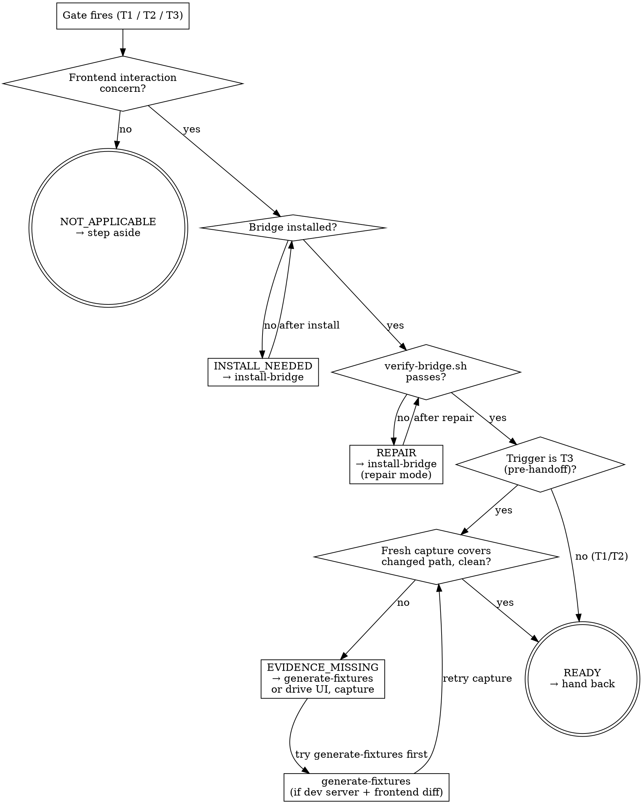

# Runbug Gate

<HARD-GATE>
Do NOT proceed with frontend interaction work (debug, TDD, or handoff) before this gate returns READY. Small tweaks accumulate. The "uhhh that's not it" moment is preventable only if the gate runs.
</HARD-GATE>

<HARD-GATE>
Do NOT use Playwright or browser-MCP in place of this gate. The bridge is the sensor/effector for interaction work. Reaching for expensive browser automation is the exact failure mode runbug replaces — see the deflection rule in using-runbug.
</HARD-GATE>

## Anti-Pattern

**"This change is tiny, I don't need to gate it."** Every frontend interaction change gets the gate. A button label change that affects a click handler gets the gate. A form field that now validates on blur gets the gate. The rationalization that "it's too small" is how the "uhhh that's not it" moment arrives.

## Core Principle

The gate's job is routing, not debugging. It inspects the current state, returns a verdict, and either clears the path (READY) or routes to the right remediation (`install-bridge`, or "drive the UI and capture"). It does not itself run debugging loops, write tests, or modify the app.

## Triggers

Fire on:

- **T1** — Claude is about to invoke `superpowers:systematic-debugging` on an interaction-triggered bug
- **T2** — Claude is about to invoke `superpowers:test-driven-development` on a UI interaction test
- **T3** — Claude is about to report frontend changes complete / hand off to user

## Process Flow

## Checklist

Complete in order. Backtracking is allowed on failed branches (each retry loop is capped at 3 attempts).

1. Classify the trigger — T1, T2, or T3
2. Answer "frontend interaction concern?" using the checklist below. If no → return NOT_APPLICABLE, stop.
3. Check whether `.runbug/` exists in the workspace with a valid shim + backend entrypoint. If not → return INSTALL_NEEDED, invoke `install-bridge`, re-enter from step 3 (up to 3 attempts; on exhaustion return `BLOCKED_INSTALL`).
4. Run `skills/install-bridge/scripts/verify-bridge.sh` from the target project root. If it exits non-zero → return REPAIR, invoke `install-bridge` in repair mode, re-enter from step 4 (up to 3 attempts; on exhaustion return `BLOCKED_REPAIR`).
5. If trigger is T1 or T2 → return READY, hand back to the caller.
6. If trigger is T3 → proceed to evidence check.
7. Evidence check: locate the most recent `.runbug/captures/*.ndjson` file. If none, or mtime is older than the last frontend-affecting change in `git diff HEAD`, or the capture trace does not intersect the changed AX elements, or the capture's console stream has unexplained errors → return EVIDENCE_MISSING. Remediation branch:

   a. If `.runbug/fixtures.ndjson` does not exist AND the dev server is reachable AND `git diff HEAD` touches frontend files (`*.tsx`, `*.jsx`, `*.vue`, `*.svelte`, `*.html`, `*.css`): invoke `generate-fixtures` with the dev server URL (`$RUNBUG_URL`, or the `--url <base>` override) — same convention HARD-GATE I5 in `install-bridge` enforces. If it emits ≥1 fixture line, re-run `capture.sh --fixtures .runbug/fixtures.ndjson` and re-enter from step 7.

   b. If `generate-fixtures` fails open (zero lines), OR if the diff touches only non-frontend files, OR if the dev server is unreachable: fall back to the existing hand-authoring instruction (drive the interaction manually via `do.sh` / hand-write fixtures / direct UI drive).

   Retry cap: up to 3 attempts; on exhaustion return `BLOCKED_CAPTURE`.
8. Return READY.

## Frontend Interaction Concern Checklist

Claude makes the yes/no call using these signals.

**YES signals (any one → frontend interaction concern):**
- Clicks, button presses, link navigation (client-side)
- Form input, field validation, submit handlers
- Drag/drop interactions
- Canvas, WebGL, or any imperative rendering triggered by user input
- Client-side route changes
- State-after-action bugs (the thing that breaks *only* after a user does something)
- Event-handler throws (onClick, onSubmit, onChange)
- Async UI updates (fetch-then-render, subscribe-then-render)

**NO signals (all apply → NOT_APPLICABLE):**
- Backend-only bug (5xx from API, DB error, job queue failure)
- Build / compile / type error
- SSR crash visible in dev-server terminal
- Pure unit test with no DOM
- Non-web project
- CSS-only change with no behavior delta
- Copy edit with no interaction impact

Ambiguous cases default to NOT_APPLICABLE. Runbug steps aside cheaply; it does not gate on uncertainty.

## Verdicts

| Verdict | When | Next action |
|---|---|---|
| `NOT_APPLICABLE` | Not a frontend interaction concern | Gate steps aside; normal superpowers proceeds |
| `INSTALL_NEEDED` | No runbug bridge in workspace | Invoke `install-bridge`; re-gate |
| `REPAIR` | Bridge present but verify-bridge.sh fails | Invoke `install-bridge` in repair mode; re-gate |
| `EVIDENCE_MISSING` | T3 only — bridge live but no fresh capture covers the changed path | Claude drives the changed interaction, captures, re-gates |
| `READY` | All preconditions met | Hand back to calling superpowers skill (T1/T2) or allow handoff to user (T3) |
| `BLOCKED_INSTALL` | install-bridge could not land a working shim in 3 attempts | Escalate to human |
| `BLOCKED_REPAIR` | verify-bridge.sh keeps failing after 3 repair attempts | Escalate to human |
| `BLOCKED_CAPTURE` | Clean capture for changed path unproducible in 3 tries — the change likely has a real bug | Escalate to human |

## Gate Functions

- BEFORE returning NOT_APPLICABLE: "Am I dismissing a real frontend interaction concern because answering it would require work, or because it is genuinely out of scope?"
- BEFORE returning READY on T1/T2: "Does `verify-bridge.sh` actually pass right now, or am I relying on an earlier run?"
- BEFORE returning READY on T3: "Did a fresh capture run, and does its trace genuinely touch the changed AX elements, or am I waving through stale evidence?"
- BEFORE returning BLOCKED: "Have I actually tried 3 times with meaningfully different approaches, or am I giving up on the same failed approach?"

## Rationalization Table

| You think... | Reality |
|---|---|
| "This change is too small for the gate" | Small changes are where the "uhhh that's not it" moment hides. Gate. |
| "The bridge was fine an hour ago, I don't need to re-verify" | State changes. Dev servers crash. verify-bridge.sh costs seconds. Run it. |
| "I can read the code and tell it works" | Reading ≠ running. T3 demands captured evidence, not reasoning. |
| "This is a CSS-only change, interaction concern is NO" | Correct — return NOT_APPLICABLE. But double-check: did the CSS affect hover, focus, active, or disabled interactive states? If yes, it's YES. |
| "I'll just use Playwright, it's only this once" | "Just this once" is how the token burn establishes itself. The gate exists to break that pattern. |
| "The capture trace missed the changed button but I know the code works" | Then the capture did not cover the changed path. Return EVIDENCE_MISSING and drive the button. |
| "3 attempts isn't enough, let me keep trying" | On loop exhaustion, the signal is "something real is wrong." Escalate. Do not silently keep looping. |
| Running `capture.sh` feels heavy for one click | `do.sh` is one curl call. Use it. |

## Red Flags

- Reaching for Playwright, browser-MCP, or asking the human to "click X and report back"
- Returning READY without having run `verify-bridge.sh` in the current session
- Skipping the evidence check on T3 because "the diff looks small"
- Treating BLOCKED as a suggestion — looping beyond the cap
- Claiming the gate is "overkill for this project"
- Adding a `data-testid` to the app instead of an `aria-label` to make the gate happy

## Key Principles

- **Router, not debugger.** The gate routes; superpowers debugs.
- **Claude-judgment on scope, evidence-based on the rest.** "Frontend interaction concern?" trusts Claude; every other check is objective (file exists, script exits 0, capture covers diff).
- **Bounded retries.** 3 attempts per loop, then BLOCKED. No silent infinite looping.
- **Composition over replacement.** READY means "hand back to superpowers." It does not mean "the gate took over."

## The Bottom Line

Print GATE: <VERDICT> at the end of each gate invocation, followed by one of:

- `HAND BACK TO: <caller>` (for READY)
- `INVOKE: install-bridge` (for INSTALL_NEEDED)
- `INVOKE: install-bridge --repair` (for REPAIR)
- `CAPTURE NEEDED: <elements>. Try ONE of: (auto) invoke the generate-fixtures skill with $RUNBUG_URL then sh <plugin>/skills/install-bridge/scripts/capture.sh --fixtures .runbug/fixtures.ndjson | (manual) sh <plugin>/skills/install-bridge/scripts/snap.sh (quick state check) | sh <plugin>/skills/install-bridge/scripts/do.sh <role> <name> <action> [value] [nth] (single action) | sh <plugin>/skills/install-bridge/scripts/capture.sh --fixtures <file> (hand-authored fixtures)` (for EVIDENCE_MISSING)
- `STEPPING ASIDE` (for NOT_APPLICABLE)
- `ESCALATE: <reason>` (for BLOCKED_*)
